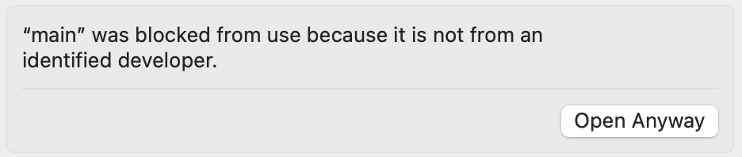
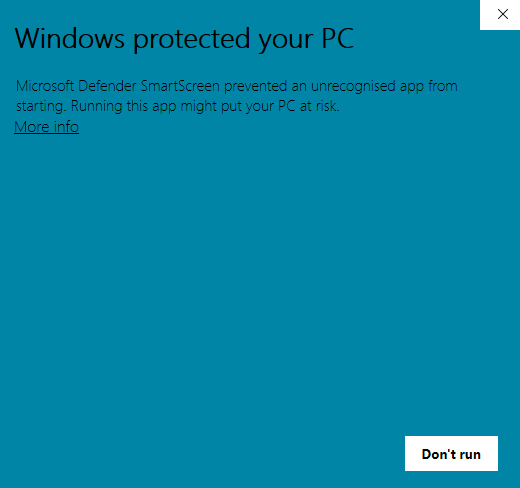
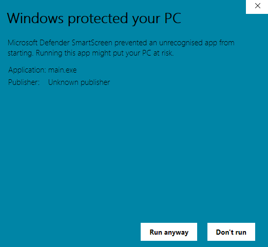

# EPAI Sentiment Analysis of Tweets Project

## Project Description
Toxic posts, abuse, accusation, attack, and hateful language have become regular phenomena. One way to contain such posts is through content moderation. But the bigger problem with hate speeches is that they are hard to contain when they go into the internet, especially on popular social media platforms. In this project, we ask, can we design something to contain harmful posts even before a user posts them online? To answer this question, we have created an application for hate speech detection using NLP models. 

## Dataset
The [Measuring Hate Speech Dataset](https://huggingface.co/datasets/ucberkeley-dlab/measuring-hate-speech) from UC Berkeley was used and contains 39,565 comments from Youtube, Reddit and Twitter. After cleaning, each comment is between 4 and 600 characters long. 7,912 annotators went through the comments and for each, indicated any identities described, and evaluated 10 labels. The labels we used were Respect, Insult, Humiliate, Status, Dehumanize, Violence, Genocide, and Attack Defend. Respect describes whether the comment was respectful towards the group(s) in the comment. Insult describes whether the comment was insulting the group(s) mentioned. Humiliate describes whether the comment was humiliating the group(s) mentioned. Dehumanize describes whether the comment dehumanized the group(s) mentioned. Violence describes whether the comment called for using violence against the group(s) mentioned. Genocide describes whether the comment calls for the deliberate killing of the group(s) mentioned. Aside from Status and Attack-Defend, each label was an ordinal Likert-style variable with 5 response options: strongly disagree, disagree, neutral, agree, strongly agree. Status describes whether the comment describes the group(s) in the comment as strongly inferior, inferior, neutral, superior, or strongly superior, and Attack-Defend describes whether the comment was strongly defending, defending, neutral, supporting, or strongly supporting the group(s) mentioned. For each label, all the ratings of the label were combined into a continuous score for each comment.

## Data Processing
The dataset was processed using the Pandas and Numpy libraries. All comments were cleaned so that punctuations are separated and counted as individual “words” for the convenience of sentiment analysis. Due to the nature of our task and the problematic language in the dataset, pre-built word embeddings such as GloVe and BERT could not be used, thus a custom word embedding library was needed. Thus, all words were compiled into a dictionary to create word-to-index and index-to-word mappings for lookup; the lookup arrays were then stored into their respective pickle files. The data was then split using a 70:15:15 train:validation:test ratio, with around 90k training samples, and 20k validation 

## Model & Results
Using the processed data, we have experimented with three models: basic RNN, LSTM, and GRU. Out of the three models, RNN was first trained, though the model had trouble learning in later epochs, and the validation accuracy was capped at around 30%. Though tweets are short by nature and limited by a character count, our dataset contained longer comments, so we still decided to try out models with long-term memories; indeed, an LSTM model was able to capture the long term dependencies and obtain an F1 test accuracy score of around 50%. Further experiments and fine-tuning with the GRU model presented the best results with the F1 test accuracy of 60%. 

## Limitations & Future Improvements
Though the quantitative result is promising, qualitative testing has exposed several limitations of the model. For starters, due to our customized word embeddings, if the model receives words that did not exist in the data set, it will ignore that word; this means that if the user makes any typos, uses any slangs that are recently invented, etc., the result will be less accurate since the model will not be able to capture the sentiment of words it does not recognize. Secondly, the model produces more accurate scores when the inputted text is longer. This phenomenon could be caused by the nature of the training data, and could be potentially improved with more training data containing short text. Lastly, due to the stochastic nature of the model, the sentiment scores will fluctuate when the model analyzes the same body of text; based on qualitative observations, in categories where the distribution of scores are not even, such as Violence and Genocide, the score fluctuation could be as high as 15%, while categories with an even distribution such as Humiliate and Dehumanize produces smaller fluctuations (see histograms below). This behaviour could be improved by balancing the distribution in the data processing stage, though this could prove difficult since there exist relationships between the categories. For instance, the categories Violence and Genocide are intrinsically linked, as well, Attack Defend is usually the opposite of Insult. It will be difficult to balance one category without visibly impacting other training categories. 

## How to Download our Application
1. Download the macOS version [here](https://www.mediafire.com/file/8czyfoy10s1non9/EPAI_Sentiment_Analyzer_%2528mac%2529.zip/file) or Windows version [here](https://www.mediafire.com/file/skhrdj8ovkxy8pq/EPAI_Sentiment_Analyzer_%2528windows%2529.zip/file)
2. Unzip the downloaded folder and then run the main.exe (this may take up to 1 minute to load)
3. Enjoy using our application!

NOTE: If your computer shows warnings for the application being from an unidentified developer, follow the steps below

Mac:
Go to Settings -> Privacy & Security, and select “Open Anyway”

Windows: 
Select “More Info”

Select “Run Anyway”

